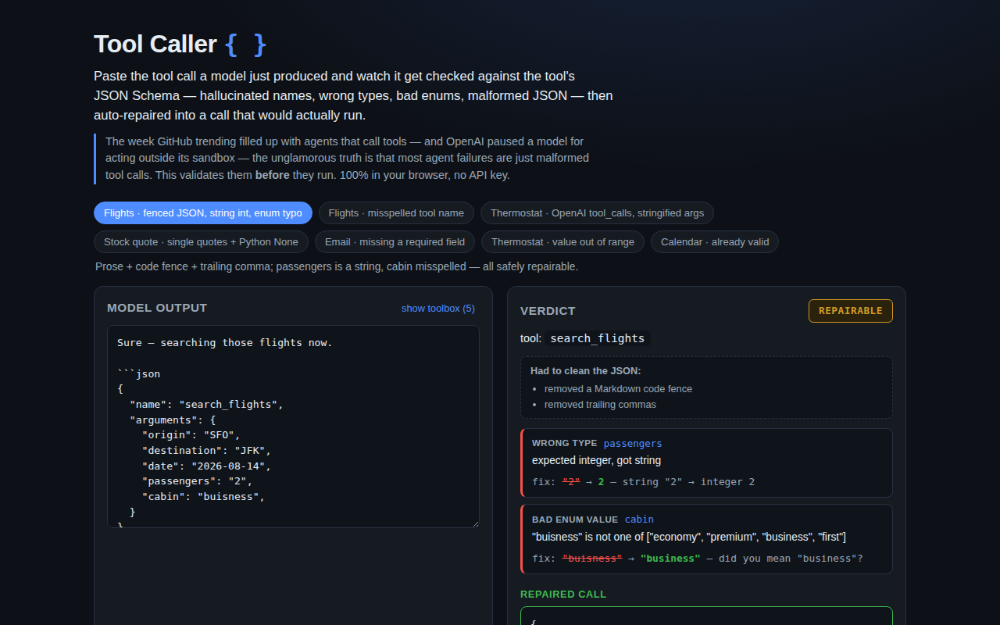

<div align="center">

# Tool Caller — Validate & Repair an LLM's Function Calls Before They Run

**Paste the tool call a model just produced and watch it get checked against the tool's JSON Schema — hallucinated names, wrong types, bad enums, malformed JSON — then auto-repaired into a call that would actually run. 100% in your browser, no API key.**

[](https://github.com/kbipul/tool-caller-ts/actions/workflows/ci.yml)
[](https://kbipul.github.io/tool-caller-ts/)

`Day 16` of **[kb-daily-builds](https://github.com/kbipul/kb-daily-builds)** — one AI project a day.

</div>

## What it does

The week GitHub trending filled up with agents that call tools (`openai/codex-plugin-cc`, `agentskills/agentskills`, `anthropics/claude-code`, `ChromeDevTools/chrome-devtools-mcp`) — and [OpenAI paused a model](https://www.unite.ai/openai-paused-its-erdos-model-after-sandbox-escapes/) for acting outside its sandbox — the unglamorous truth is that most agent failures aren't dramatic escapes. They're **malformed tool calls**: a stringified number, a misspelled enum, a hallucinated tool name, JSON wrapped in prose.

Tool Caller is a client-side validator for exactly that failure. Paste the raw output a model emitted (bare `{name, arguments}`, an OpenAI `tool_calls` block, an Anthropic `{name, input}`, or something fenced in prose), pick nothing, and it: recovers the JSON, matches the call to a tool, validates every argument against the tool's JSON Schema, tags each problem with a failure type from the tool-use taxonomy, and — where a fix is meaning-preserving — repairs it into a call that re-validates clean. It never guesses intent: an out-of-range number or a missing field with no default is reported as **invalid**, not silently patched.



<sub>The screenshot is captured automatically by this repo's CI on a GitHub runner (the build sandbox can't run a browser) and committed to `docs/demo.png` a few minutes after publish.</sub>

## Try it

**[Live demo →](https://kbipul.github.io/tool-caller-ts/)** — runs fully in your browser, nothing to install. Click a scenario or paste your own model output.

```bash
git clone https://github.com/kbipul/tool-caller-ts.git
cd tool-caller-ts
npm ci
npm test        # 38 unit tests
npm run dev     # open the printed localhost URL
```

## How it works

Three deterministic stages, no model in the loop:

```
raw model text
   │  parse.ts      tolerant JSON recovery: strip fences, pull the {…} out of
   │                prose, fix trailing commas / unquoted keys / Python
   │                literals / single quotes / stringified arguments
   ▼
 ToolCall { name, arguments }
   │  validate.ts   match name to a tool (Levenshtein suggests near-misses),
   │                then hand the arguments to…
   ▼
 schema.ts          a small JSON-Schema validator → Finding[] + a repaired copy
   │                (type coercion, enum near-match, drop forbidden args, fill
   │                defaults). Range / length / pattern breaks are reported,
   ▼                never "fixed".
 verdict: valid | repairable | invalid   (+ the repaired call, re-checked clean)
```

Every finding is tagged with one of seven failure types drawn from the tool-use error taxonomy in recent research (ToolCritic / ToolFailBench, 2026): hallucinated tool, missing argument, unexpected argument, wrong type, bad enum value, constraint broken, unparseable output.

The key honesty rule lives in `validate.ts`: before the UI is allowed to say **repairable**, the repaired call is re-validated from scratch — if it still has an error, the verdict is downgraded to **invalid**. A green badge always means a genuinely runnable call.

## Build notes — what I learned

The interesting design tension in a "repair" tool is knowing when *not* to. It's tempting to make every red turn green — clamp the 45°C thermostat to 30, coerce anything to anything. But a tool call is a statement of the model's intent, and a validator that fabricates intent is worse than useless in an agent loop: it turns a catchable error into a silent wrong action. So I drew a hard line. Coercions only happen when they're information-preserving and reversible: `"2"` → `2`, `"buisness"` → `"business"` (a one-edit enum neighbour), dropping an argument the schema forbids. Anything that requires guessing a value — an out-of-range number, a missing field with no default, a regex that doesn't match — is reported and the call stays **invalid**. The taxonomy came straight from this week's tool-use-failure papers, which was a nice reminder that the boring reliability problems are the ones with real literature behind them.

The tolerant JSON parser was the part that grew the most. My first version just stripped code fences; then real model outputs kept breaking it — trailing commas, `True`/`None`, single quotes, and OpenAI's habit of *stringifying* the arguments object so you have to parse twice. I ended up with a small pipeline that applies one lenient transform at a time and re-tries `JSON.parse` after each, recording every fix as a note the UI shows ("had to clean the JSON: removed trailing commas, converted single quotes"). That transparency matters: recovering a call is not the same as the model having produced a valid one, and the tool shouldn't paper over that.

The single most valuable test isn't any individual case — it's the invariant at the bottom of `validate.test.ts` that loops every scenario and asserts that anything marked **repairable** re-validates to **valid** after repair. That one test caught two bugs where a "fix" left a nested problem behind. It's the executable version of the product's core promise.

What I'd do differently: the validator is single-call. Two taxonomy entries — *insufficient* and *redundant* tool calls — only exist across a sequence, so catching them needs a call-list view (paste a whole trajectory, flag the duplicate `get_weather`). That's the natural next build.

## Stack

| Piece | Choice |
|---|---|
| UI | React 18 + TypeScript 5 |
| Build | Vite 6 |
| Tests | Vitest 2 (38 tests) |
| Deps | none at runtime — the validator is hand-written, zero libraries |
| Demo | GitHub Pages, 100% client-side |

---

<div align="center"><sub>
Built by <a href="https://www.kumarbipul.com"><b>Kumar Bipul</b></a> ·
IT Director → AI/ML · <a href="https://github.com/kbipul">github.com/kbipul</a>
</sub></div>
